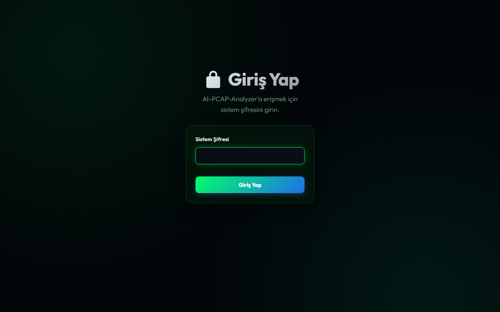
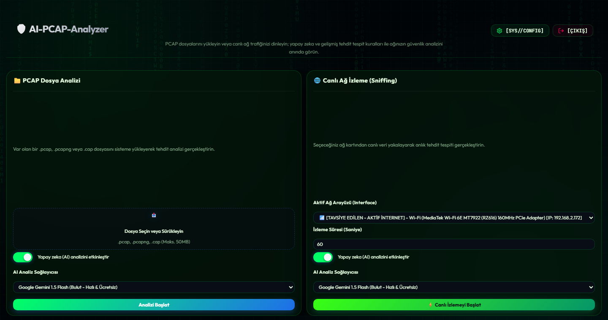
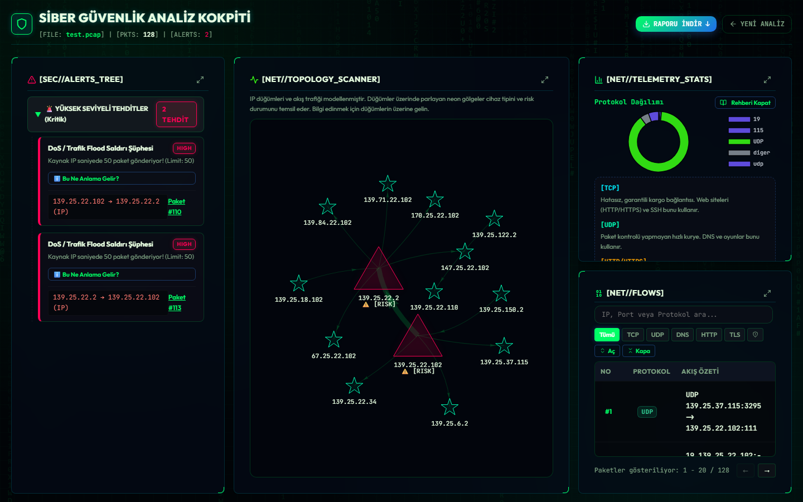
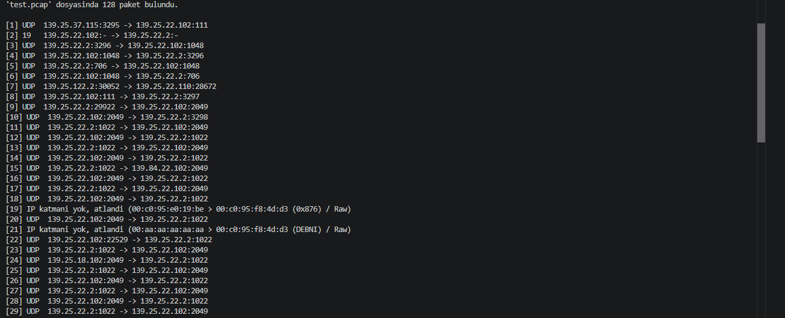

# 🛡️ AI-PCAP-Analyzer

Üniversitede aldığım ağ analizi ve kriptoloji derslerinde edindiğim teorik temeli, yapay zeka destekli araçlarla birleştirip gerçek bir problemi çözmek için geliştirdiğim açık kaynaklı bir ağ trafiği analiz platformu.

Wireshark gibi araçlar paket paket incelemede çok güçlü, ama binlerce satırlık dökümün içinde "burada bir sorun mu var?" sorusuna hızlı cevap bulmak zor oluyor. Bu proje tam olarak bunu hedefliyor: bir `.pcap` dosyasını (ya da canlı ağ trafiğini) otomatik olarak özetleyip, imza tabanlı bir kural motoruyla şüpheli davranışları işaretleyip, isteğe bağlı olarak yapay zekaya (Claude, Gemini ya da yerel Ollama modeliyle) yorumlatan, hem terminalden hem web arayüzünden kullanılabilen bir asistan.

---

## 📸 Ekran Görüntüleri

<table>
<tr>
<td width="50%">

**Giriş ekranı**
Uygulama ilk açıldığında otomatik oluşturulan bir sistem şifresiyle korunuyor.



</td>
<td width="50%">

**Ana panel**
Dosya yükleme ve canlı ağ dinleme aynı ekrandan yönetiliyor; aktif internet bağlantısı olan ağ kartı otomatik öneriliyor.



</td>
</tr>
</table>

**Analiz kokpiti** — tehdit listesi, IP/trafik ilişki grafiği, protokol dağılımı ve akış tablosu tek ekranda:



**Terminalden çıktı** (CLI kullanımı):



---

## ✨ Özellikler

### Analiz motoru
- **Protokol ayrıştırma** — IP, TCP, UDP, ARP, DNS (sorgu/yanıt), HTTP (istek/yanıt), TLS (ClientHello SNI)
- **Akış bazlı trafik özeti** — protokol dağılımı, en çok trafiğe karışan IP'ler, en çok hedeflenen portlar
- **Kural tabanlı tehdit tespiti** — 14 farklı imza/heuristik kural: port taraması, ARP spoofing, DoS/SYN flood, SQL injection, XSS, path traversal, şüpheli tarama araçları (nmap/sqlmap/nikto vb.), açık metin kimlik bilgisi/FTP sızıntısı, bilinen kötü amaçlı portlar
- **Bozuk/eksik paketlere dayanıklı** — hatalı katmanlı paketler programı çökertmeden atlanır

### Yapay zeka desteği
- Üç farklı sağlayıcı arasında seçim: **Claude (Anthropic)**, **Google Gemini**, ya da tamamen çevrimdışı çalışan **Ollama** (yerel model)
- Paket özetleri ve kural motorunun bulguları modele gönderilip Türkçe, okunabilir bir güvenlik raporu üretiliyor

### Web arayüzü
- Dosya yükleyip sonucu tarayıcıda görme, ya da seçilen ağ kartından **canlı yakalama** başlatma
- Analiz sonuçları; tehdit ağacı, IP ilişki grafiği (vis-network), protokol dağılım grafiği (Chart.js) ve aranabilir/sayfalanabilir paket tablosu ile "kokpit" tarzı tek ekranda sunuluyor
- API anahtarları (Claude/Gemini/Ollama) arayüzdeki ayarlar panelinden, terminale hiç dokunmadan yönetilebiliyor

### Güvenlik
Bu bir ağ güvenliği aracı olduğu için kendi güvenliğine de aynı ciddiyetle yaklaştım:
- Şifre + oturum tabanlı kimlik doğrulama (ilk çalıştırmada otomatik oluşturulur), 2 saatlik oturum zaman aşımı
- Tüm formlar CSRF korumalı, güvenlik başlıkları (CSP, X-Frame-Options, HSTS vb.) uygulanıyor
- Yakalanan/yüklenen `.pcap` dosyaları işlendikten hemen sonra üzerine yazılarak güvenli şekilde siliniyor
- API anahtarı isteyen `OLLAMA_API_URL` gibi ayarlar SSRF'e karşı doğrulanıyor, hassas endpoint'ler rate-limit'li
- Loglardaki olası API anahtarı/şifre izleri otomatik maskeleniyor

---

## 🛠️ Kullanılan Teknolojiler

- **Python** — çekirdek mantık
- **Scapy** — paket okuma/ayrıştırma (IP, TCP, UDP, ARP, DNS, HTTP, TLS)
- **cryptography** — Scapy'nin TLS katmanı için
- **Anthropic Claude / Google Gemini / Ollama** — yapay zeka destekli analiz
- **Flask** + **Flask-Limiter** + **Flask-WTF** — web arayüzü, rate limiting, CSRF koruması
- **Chart.js** / **vis-network** — analiz kokpitindeki grafikler
- **pytest** + **bandit** — test paketi ve statik güvenlik taraması
- **python-dotenv** — `.env` ile yapılandırma yönetimi

---

## ⚙️ Kurulum

```bash
# Projeyi klonlayın
git clone https://github.com/EnesKok20/ai-pcap-analyzer.git
cd ai-pcap-analyzer

# Gerekli kütüphaneleri yükleyin
pip install -r requirements.txt

# .env.example dosyasini .env olarak kopyalayin
cp .env.example .env
```

Yapay zeka analizini kullanmak istiyorsanız `.env` dosyasına en az bir sağlayıcının anahtarını ekleyin — [Anthropic](https://console.anthropic.com/settings/keys) ya da [Google AI Studio](https://aistudio.google.com/) üzerinden ücretsiz alabilirsiniz. Hiçbirini eklemeseniz de web arayüzündeki ayarlar panelinden sonradan girebilirsiniz. Ollama kullanacaksanız [ollama.com](https://ollama.com/)'dan indirip yerelde çalıştırmanız yeterli.

`.env` dosyası `.gitignore`'dadır, GitHub'a asla gönderilmez.

---

## 🚀 Kullanım

### 1. Web arayüzü — dosya yükle veya canlı dinle, tarayıcıda gör

```bash
python app.py
```

`http://127.0.0.1:5000` adresine gidin. İlk çalıştırmada terminalde otomatik oluşturulan bir giriş şifresi gösterilir (`.env` dosyasındaki `APP_PASSWORD` ile de kendi şifrenizi belirleyebilirsiniz).

### 2. Komut satırı — var olan bir pcap dosyasını analiz et

```bash
python main.py ornek.pcap
python main.py ornek.pcap --ai   # + yapay zeka yorumu
```

### 3. Canlı yakalama — arka planda çalışıp özet rapor üret

```bash
python capture.py --sure 480 --ai --kaydet-pcap
```

- `--sure DAKIKA` — belirtilen süre sonunda otomatik durur (belirtilmezse `Ctrl+C` ile durdurulur)
- `--ai` — bitince trafiği yapay zeka ile de yorumlatır
- `--kaydet-pcap` — ham paketleri de bir `.pcap` dosyasına kaydeder (Wireshark'ta incelemek için)

Rapor ve (varsa) `.pcap` dosyası `captures/` klasörüne kaydedilir (bu klasör `.gitignore`'dadır — gerçek ağ trafiği hassas veri sayılır).

> **Not:** Canlı yakalama Windows'ta [Npcap](https://npcap.com/) gerektirir (Wireshark kuruluysa genelde zaten kuruludur). Bazı kurulumlarda terminali "Yönetici olarak çalıştır" ile açmanız gerekebilir.

---

## 🧪 Testler

```bash
pip install -r requirements-dev.txt
pytest -v
```

Testler gerçek AI sağlayıcılarına istek atmaz — sahte (mock) istemciler kullanır. Ayrıca statik güvenlik taraması için:

```bash
pip install bandit
bandit app.py main.py -q
```

---

## 📁 Proje Yapısı

```
main.py       - CLI aracı + paket ayrıştırma / trafik istatistiği çekirdek mantığı
app.py        - Flask web arayüzü, kimlik doğrulama, güvenlik katmanları
rules.py      - imza/heuristik tabanlı tehdit tespit kural motoru
capture.py    - canlı paket yakalama ve gün sonu özet raporu
templates/    - web arayüzü HTML şablonları
static/       - web arayüzü CSS ve JS'i
tests/        - pytest test paketi
```

---

## 🗺️ Yol Haritası

- [ ] Analiz sonuçlarını JSON/Markdown olarak dışa aktarma
- [ ] Daha fazla protokol desteği (ICMP detayları, QUIC vb.)
- [ ] Çoklu kullanıcı desteği ve rol tabanlı yetkilendirme

Bu proje aktif olarak, gün gün geliştirilmeye devam ediyor.
